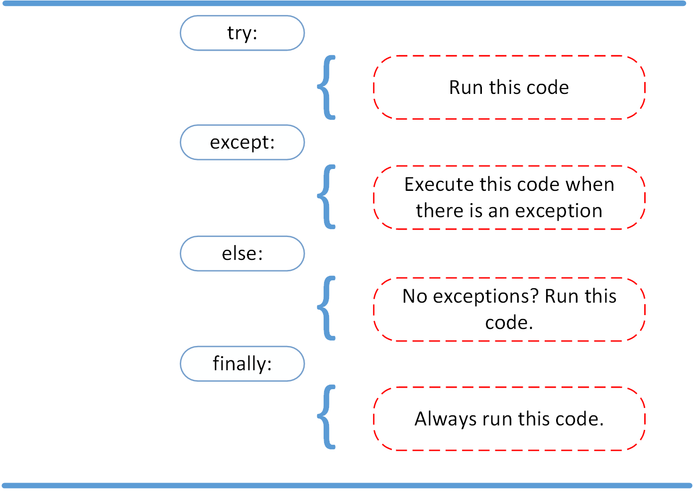

# Read: Class 03

---

> [Back to Home](../README.md)

---

## Handling exceptions

    A Python program terminates as soon as it encounters an error. In Python, an error can be a syntax error or an exception. So instead of it Teriminates we should Handle the Errors by The {try,except,else, funally,assert,raise}

- try: will always try to run the program written inside it
- except :once the program encounters an error it will execute the exception commands

- **Example:**
  

-there is also else and finally:

    else: lets you code sections that should run only when no exceptions are encountered in the try clause.
    finally: Always run this code at the end.

- **Example:**
  

---

- **quiz submission :**
  

  > [Back to Home](../README.md)
