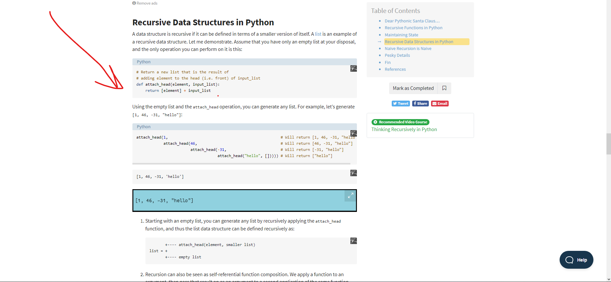

# Read: Class 04

---

> [Back to Home](../README.md)

---

> [references](https://www.learnpython.org/en/Classes_and_Objects)

## Classes and objects

    Objects are an encapsulation of variables and functions into a single entity. Objects get their variables and functions from classes. Classes are essentially a template to create your objects.

### example (A very basic class would look like this:)

    class MyClass:
      variable = "blah"

      def function(self):
        print("This is a message inside the class.")

### to access the objects variables(we use the `.` memeber access operator)

    class MyClass:
      variable = "blah"
      def function(self):
        print("This is a message inside the class.")
    myobjectx = MyClass()
    myobjectx.variable #< this line

### to access the objects functions(we also use the `.` memeber access operator)

    class MyClass:
      variable = "blah"
      def function(self):
        print("This is a message inside the class.")
    myobjectx = MyClass()
    myobjectx.function() #< this line

### init()

    The __init__() function, is a special function that is called when the class is being initiated. It's used for asigning values in a class.

## Dictionaries

    A dictionary is a data type similar to arrays, but works with keys and values instead of indexes. Each value stored in a dictionary can be accessed using a key, which is any type of object (a string, a number, a list, etc.) instead of using its index to address it.

- **Example:**

      phonebook = {
        "John" : 938477566,
        "Jack" : 938377264,
         "Jill" : 947662781
      }
      print(phonebook)

### Iterating over dictionaries

Dictionaries can be iterated over, just like a list. However, a dictionary, unlike a list, does not keep the order of the values stored in it. To iterate over key value pairs, use the following syntax:

    phonebook = {
      "John" : 938477566,
      "Jack" : 938377264,
      "Jill" : 947662781}
    for name, number in phonebook.items():
      print("Phone number of %s is %d" % (name, number))

---

### removing a value

To remove a specified index, use either one of the following notations:

    # with del !

    phonebook = {
      "John" : 938477566,
      "Jack" : 938377264,
      "Jill" : 947662781
    }
    del phonebook["John"]
      print(phonebook)

---

    # Or with .Pop method

    phonebook = {
      "John" : 938477566,
      "Jack" : 938377264,
      "Jill" : 947662781
    }
    phonebook.pop("John")
      print(phonebook)

---

[references](https://realpython.com/python-thinking-recursively/)

## Thinking Recursively in python

### **“Of all ideas I have introduced to children, recursion stands out as the one idea that is particularly able to evoke an excited response.” — Seymour Papert, Mindstorms**

## Recursive Data Structures in Python

    A data structure is recursive if it can be defined in terms of a smaller version of itself. A list is an example of a recursive data structure. Let me demonstrate. Assume that you have only an empty list at your disposal, and the only operation you can perform on it is this:

---

    # Return a new list that is the result of
    # adding element to the head (i.e. front) of input_list
    def attach_head(element, input_list):
        return [element] + input_list

## Naive Recursion is Naive

    The Fibonacci numbers were originally defined by the Italian mathematician Fibonacci in the thirteenth century to model the growth of rabbit populations. Fibonacci surmised that the number of pairs of rabbits born in a given year is equal to the number of pairs of rabbits born in each of the two previous years, starting from one pair of rabbits in the first year.

> [Back to Home](../README.md)
