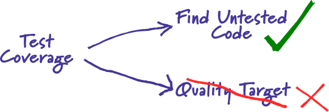

# Read: Class 05

---

> [Back to Home](../README.md)

---

> [references](https://www.pythonforbeginners.com/random/how-to-use-the-random-module-in-python)

## How to Use Random

> when to use it?

    We want the computer to pick a random number in a given range Pick a random element from a list, pick a random card from a deck, flip a coin etc. When making your password database more secure or powering a random page feature of your website.

### examples

    1- RandInt : Randoms an Int Number
    2- Random : Random Number from 0 <=> 100 ; Hint : you can Multiply it with a factor of you choice *100 or *10 or *0.1
    3- choice : Generate a random value from the sequence sequence.
    4- Shuffle : The shuffle function, shuffles the elements in list in place, so they are in a random order.
    5- Randrange : Generate a randomly selected element from range(start, stop, step)

---

> [references](https://www.edureka.co/blog/risk-analysis-in-software-testing/)

## What is Risk analysis in Software Testing?

     in any software, using risk analysis at the beginning of a project highlights the potential problem areas. After knowing about the risk areas, it helps the developers and managers to mitigate the risks. When a test plan has been created, risks involved in testing the product are to be taken into consideration along with the possibility of the damage they may cause to your software along with solutions.

### example of possible risks

    1- Use of new hardware
    2- Use of new technology
    3- Use of new automation tool
    4- The sequence of code
    5- Availability of test resources for the application

### How to perform Risk Analysis?

There are three steps:

    Searching the risk

    Analyzing the impact of each individual risk

    Measures for the risk identified

---

> [references](https://martinfowler.com/bliki/TestCoverage.html)

## Test Coverage // Code Coverage

    should aim for, or stating their coverage levels with pride. Such statements miss the point. Test coverage is a useful tool for finding untested parts of a codebase. Test coverage is of little use as a numeric statement of how good your tests are.

    If you make a certain level of coverage a target, people will try to attain it. The trouble is that high coverage numbers are too easy to reach with low quality testing. At the most absurd level you have AssertionFreeTesting. But even without that you get lots of tests looking for things that rarely go wrong distracting you from testing the things that really matter.

> [Back to Home](../README.md)
