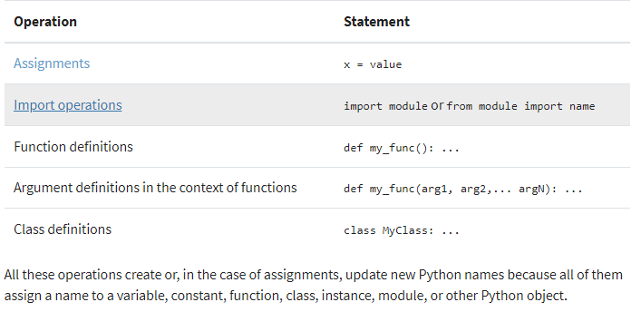

# Read: Class 07

---

> [Back to Home](../README.md)

---

> [references](https://realpython.com/python-scope-legb-rule/)

## Python Scope

> What is it?

    The concept of scope rules how variables and names are looked up in your code. It determines the visibility of a variable within the code.

### examples

    1- Global scope
    2- Local scope

---

## Names and Scopes in Python

     Since Python is a dynamically-typed language, variables in Python come into existence when you first assign them a value. On the other hand, functions and classes are available after you define them using def or class, respectively. Finally, modules exist after you import them. As a summary, you can create Python names through one of the following operations:-

## 

---

## Nested Functions: The Enclosing Scope

    Enclosing or nonlocal scope is observed when you nest functions inside other functions. The enclosing scope was added in Python 2.2. It takes the form of the local scope of any enclosing function’s local scopes. Names that you define in the enclosing Python scope are commonly known as nonlocal names.

## Modifying the Behavior of a Python Scope

    Even though Python scopes follow these general rules by default, there are ways to modify this standard behavior. Python provides two keywords that allow you to modify the content of global and nonlocal names. These two keywords are:

    1- global
    2- nonlocal

> [Back to Home](../README.md)
